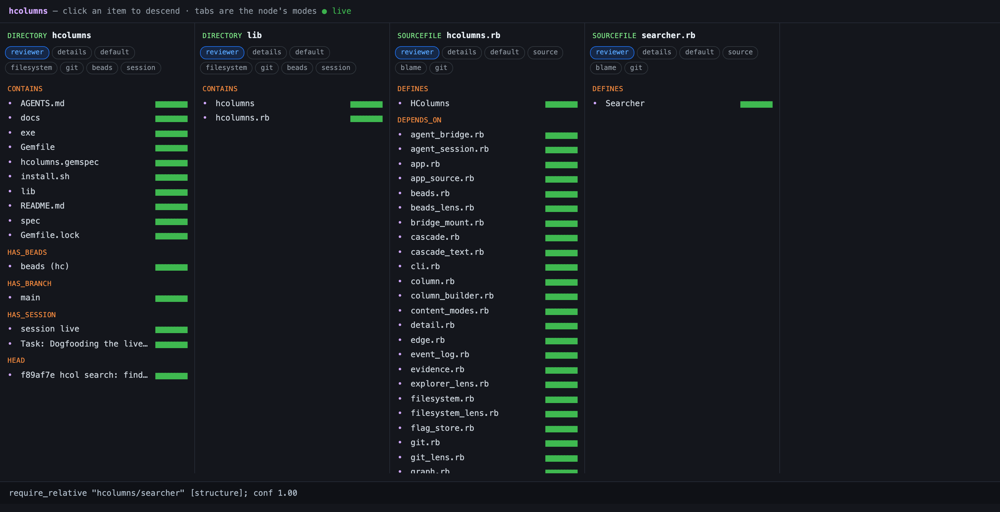
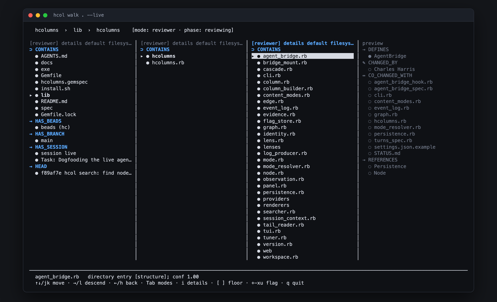
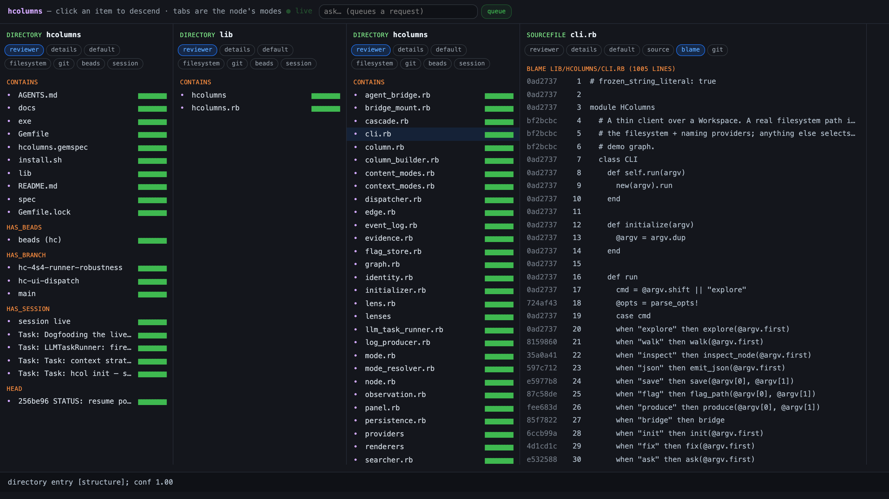
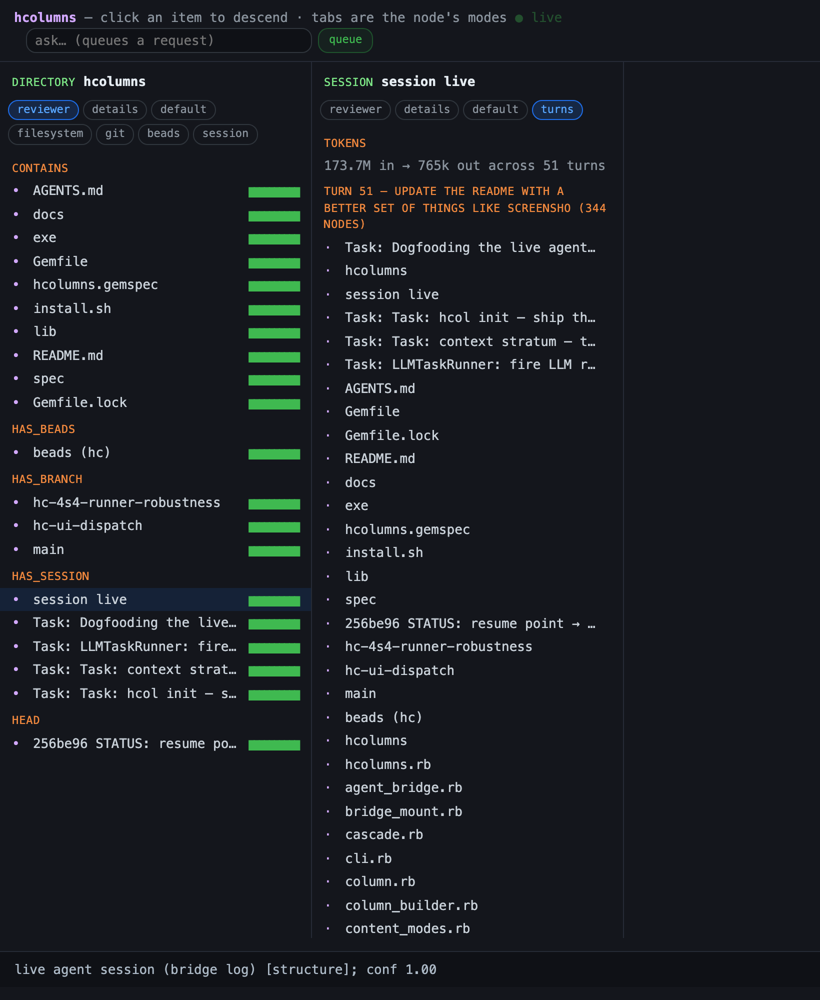

# hcolumns

Semantically-directed Miller columns — **Harris Columns** ("h-columns").

A structured, directed way to explore a **property graph**: the same data a
Neo4j-style browser holds (nodes + typed/weighted relationships + properties),
rendered as ranked, relation-grouped, **walkable columns** instead of a freeform
canvas. "Children of a folder" is just the special case where the only relation
is `CONTAINS`.

Point it at a real repo and it composes one graph out of the strata that are
already there — the **filesystem**, **git** history, the **beads** issue DB, the
**Ruby** code itself, and the **live agent session** editing it — then lets you
walk across them. A directory's children, the commit that last touched a line,
the issue that asked for it, and the turn an agent did it in are all just edges.

<p align="center">
  
  <em>Every screenshot here is this repo, walked by <code>hcol</code>.</em>
</p>

A Ruby playground for the idea. See [`docs/DESIGN.md`](docs/DESIGN.md) for the
charter and [`docs/STATUS.md`](docs/STATUS.md) for where the work is.

## Install

Ruby **>= 3.0**. No runtime dependencies.

```sh
git clone https://github.com/charlesharris/hcolumns && cd hcolumns
bundle install
bundle exec rspec        # 256 examples, golden-tested

./install.sh             # build + install the gem, so `hcol` is on your PATH
./install.sh -s          # …skipping tests
```

`install.sh` is idempotent — run it as often as you like; it always leaves
exactly the current version installed. For a dev run **without** installing, use
`./exe/hcol` (or `bundle exec ruby -Ilib exe/hcol`) anywhere below.

> The **beads** provider is the one soft dependency: it reads the `bd` issue
> database over a MySQL wire connection and needs the `ruby-mysql` gem (already
> in the `Gemfile`). Without it that provider reports unavailable and everything
> else stays zero-dep.

## Try it in 30 seconds

No setup, no repo — an in-memory fixture graph:

```sh
hcol explore             # the demo column for src/orders.rb
hcol explore repo/       # the CONTAINS (Miller-baseline) column
hcol nodes               # list nodes in the demo graph
hcol inspect             # provenance + confidence math for one node
```

```
▸ src/orders.rb  (SourceFile)
  ⇄ PAIR
      ● spec/orders_spec.rb        ▰▰▰▰▰  name matches spec/orders_spec.rb [convention+human]; conf 0.98
  ↔ CO_CHANGED_WITH
      ◌ src/payments.rb            ▰▰▱▱▱  changed together in 14 of 90 days [history]; conf 0.46
      · src/inventory.rb           ▰▱▱▱▱  changed together in 5 of 90 days [history]; conf 0.20
  ✎ CHANGED_BY
      ◌ alice                      ▰▰▱▱▱  37 commits [history]; conf 0.34
```

`●` confirmed · `◐` reinforced · `◌` suggested · `·` observed — the **maturity**
of an edge, derived from how much evidence backs it. The bar is confidence.

## Walking a real repo

Point either front-end at a directory. Nothing is indexed up front: providers
are **lazy**, so a node's neighbors are only loaded when its column is first
asked for.

### In the terminal

```sh
hcol walk .              # interactively walk the cwd
hcol explore lib         # print one ranked column, no TUI
```

<p align="center">
  
</p>

| key | does |
| --- | --- |
| `↑↓` / `jk` | move |
| `→` / `l` | descend |
| `←` / `h` | back |
| `Tab` | cycle the column's **modes** (tabs) |
| `i` | details: data, provenance, confidence math |
| `[` `]` | move the confidence floor |
| `+` `-` `x` `u` | flag the selection up / down / excluded / clear |
| `q` | quit |

### In a browser

```sh
hcol serve .             # http://127.0.0.1:4567
hcol serve . --port 8080
```

Same columns, same data contract — the Panel/Node model serializes to JSON and a
zero-dep HTTP server renders it. Click an item to descend; the tabs are the
node's modes. Nothing about the graph lives in either renderer.

### Tabs are the node's modes

Each column has **modes** for its node: an auto mode picked by node type, plus
alternatives (`Tab` in the TUI, click in the browser). A node's *contents* are a
facet beside its relations — a file's `source`, a commit's `diff`, a run's
output — read from disk/git on demand, never folded into the graph.

A file in a git repo gets a **`blame`** tab: every line tagged with the commit
that last touched it, and every line is walkable. Descend a line to that
commit's change *scoped to this file*, then zoom out to the whole diff.

<p align="center">
  
</p>

### Lenses

A lens re-weights the same graph for a task — it **re-ranks, it doesn't toggle**.

```sh
hcol walk . --role reviewer      # default | reviewer | explorer | git | filesystem | beads | session
hcol walk . --strict             # sugar for --role reviewer
hcol walk . --floor 0.5          # hide edges below confidence 0.5
```

## Watching an agent work

With the bridge hook installed, a Claude Code session appends to an
append-only JSONL log, and the columns **grow as the agent works** — turns
partition the session, test runs flip `◐ → ✓/✗` live, and the auto mode follows
the agent's phase (editing → testing → reviewing).

In **any** repo, `hcol init` installs the bridge — the hook, the `hcol` agent
skill, and the `.claude/settings.json` wiring (merged into whatever hooks are
already there, so it's safe to run on a repo you've already set up):

```sh
cd ~/src/some-project
hcol init                # writes .claude/hooks/, .claude/skills/hcol/, settings.json
hcol serve .             # that repo's composed graph + its live session, over SSE
hcol walk . --live       # …same, in the terminal
```

It's idempotent — re-run it after a gem upgrade to refresh the hook (a hook
you've customized is backed up first). In *this* repo the bridge is already
wired, dogfood-style: `cp .claude/settings.json.example .claude/settings.json`.

<p align="center">
  
</p>

The `turns` tab groups the work per prompt, with token usage per turn. (That
screenshot is the session that wrote this README, mid-sentence.)

The hook is a thin shim over `hcol bridge`, which takes a neutral vocabulary —
so *any* agent can drive it, one event per argument or per stdin line:

```sh
hcol bridge --log .hcolumns/live.jsonl \
  "turn refactor the tuner" "edit lib/hcolumns/tuner.rb" "phase testing" \
  "test ok bundle exec rspec" "usage in=1200 out=340" "done"
```

Override the log path with `HCOL_BRIDGE_LOG`.

### The log is the truth

The event log sits under the read model, so a session is replayable, snapshottable
and survives a restart — the hügel "the mound persists" step.

```sh
hcol save session out.jsonl      # snapshot a session's event log
hcol walk out.jsonl              # replay it: the graph re-projects from the log
hcol produce session out.jsonl   # a separate process appends events in real time
hcol serve out.jsonl --live      # …and a consumer tails it: columns grow as lines land
```

Concurrency lives *between processes* (the file), so the in-memory log stays
single-writer and needs no mutex.

## For agents (and scripts)

The same data, without a renderer. `hcol json` is the contract the web UI is
built on, so an agent reads exactly what a human sees:

```sh
hcol search <term> [--type T]    # find nodes with no address to start from
hcol json <path>                 # a node's panel + ranked modes, as JSON
hcol json <path> --mode blame    # per-line commit attribution
hcol json session --mode turns   # what each prompt produced, with token usage
hcol json obj:<id>               # descend by id
```

`search` is the read that produces an address. One capped breadth-first
materialization crosses **every** stratum at once, so a single query answers
"where does `SSE` show up?" across git, the session, and the code:

```
$ hcol search SSE
obj:da5c341535ac98e5  Commit    9db3af8 18 — SSE: push the tail to the browser, lock-free per-connection
obj:72b7759338b7ccd9  LogLine   composed-server SSE probe
obj:e1604ae8fe101bf4  Method    #append      spec/web/sse_spec.rb
obj:c1dea47feeeaf6c4  TestFile  sse_spec.rb  spec/web/sse_spec.rb
```

Feed any printed id or path straight back to `hcol json`. The cap is **reported,
never silent** — a capped search says so rather than reading as "searched
everything". There's an [`hcol` skill](lib/hcolumns/templates/SKILL.md) that teaches
an agent this surface — `hcol init` installs it into any repo.

## How it works

```
providers append Observations            (filesystem, git, naming-rules, beads, ruby, a human, an agent, ...)
   └─> Graph folds them into Edges        (derived confidence + maturity + provenance)
        └─> Tuner scores each edge         (re-weight, don't toggle)
             └─> ColumnBuilder groups & ranks
                  └─> a Renderer displays the column
```

Observations carry the evidence; the **column never knows** what a log line or a
trace span *is* — it only sees nodes and ranked edges. A new source is just a new
provider that appends observations, and it is walkable, searchable and rankable
the day it lands.

- **Property-graph substrate** — `Node`, `Observation` (the primitive), `Edge`
  (the fold: derived confidence/maturity, with provenance), `Graph`.
- **Evidence model** — `structure | behavior | history | human | inference`, each
  with a type-weight and a decay half-life, evaluated against an injected clock.
  No wall-clock in the fold, so ranking is deterministic and testable.
- **Tuner** — `score = w_conf·confidence + w_recency·recency`, per-lens.
- **Workspace** — composes the providers and expands nodes on demand, once.
- **Two front-ends** — a TUI cascade and a web app over the *same* serialized
  panel, which is what keeps the contract in the data rather than in a renderer.

### The strata it composes

| provider | gives you |
| --- | --- |
| **filesystem** | `CONTAINS` |
| **naming-rules** | source ↔ test `PAIR` |
| **git** | `CO_CHANGED_WITH`, `CHANGED_BY`, branches, commits, per-line blame |
| **ruby** | `DEFINES`, `DEPENDS_ON`, `REFERENCES`, methods |
| **beads** | the `bd` issue DB: dependencies as typed edges, `TOUCHES` onto real files |
| **agent session** | the live session: turns, proposed changes, test runs, tokens |

## Development

```sh
bundle exec rspec                        # the whole suite
bundle exec rspec spec/searcher_spec.rb  # one file
./install.sh                             # reinstall `hcol` after a change
```

`lib/hcolumns/` is the substrate (`node`, `observation`, `edge`, `graph`,
`tuner`, `column_builder`), with `providers/` appending observations,
`lenses/` re-weighting them, `renderers/` + `tui.rb` drawing the terminal, and
`web/` serving the browser. Specs mirror that layout under `spec/`.

The repo dogfoods itself: it tracks its own work in `bd` (prefix `hc`), and the
live session above is this project being built.

## Not yet

By design — grow small and slow: more tuner knobs (confidence floor,
evidence-mix, live retune), undo/snapshot UX, persistence beyond JSONL, a
hügel-Pile provider. See [`docs/DESIGN.md`](docs/DESIGN.md) §8.

## License

MIT.
